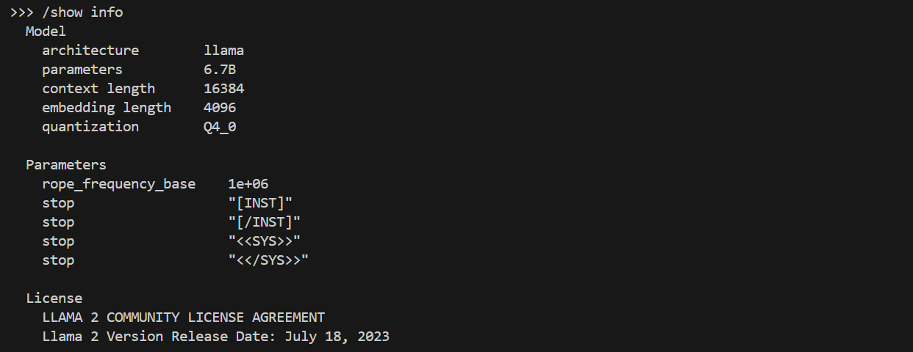
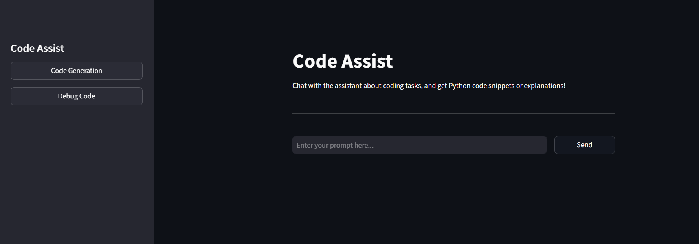
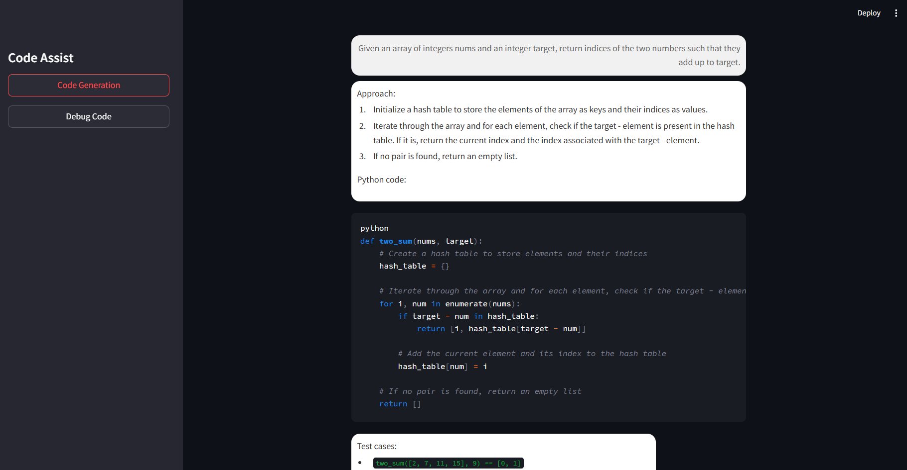
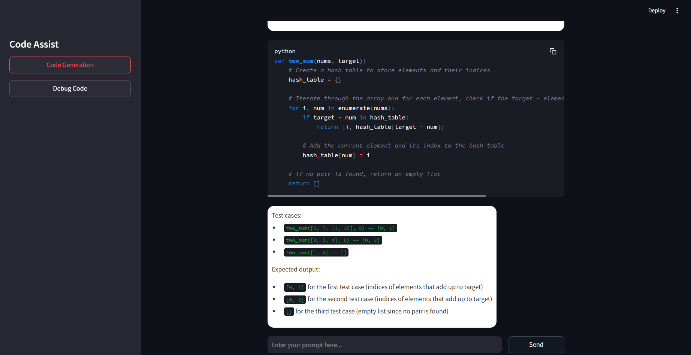

# Code Assist Chatbot

A chatbot designed to assist developers in generating code snippets or debugging existing code based on user input. This application uses a conversational interface built with Streamlit and integrates with an API for generating code responses.

---

### Why Ollama and Codellama?:
- **Ollama** offers multi-model and multi-language support, making it an excellent choice for building versatile coding assistants.
- **Codellama** is specifically trained for Python, enabling it to excel in Python-based coding tasks.
- **Qwen 2.5** has been trained on diverse datasets, supporting a broader range of languages and problem types.
---



## Approach to Design

The chatbot was designed with the following goals in mind:

1. **Ease of Use**: A user-friendly interface that provides clear instructions and supports intuitive interactions.  
2. **Flexibility**: Allows users to switch between two primary modes—**Code Generation** and **Debug Code**—to cater to different use cases.  
3. **Interactive Display**: The conversation is presented in a chat-like interface, where user messages and assistant responses are styled distinctly for better readability.  
4. **API Integration**: Communication with the `OLLAMA` API is streamlined to handle user prompts and return relevant, well-structured responses.

### Key Features
- **Mode Selection**: The sidebar allows users to toggle between `Code Generation` and `Debug Code` modes.  
- **Dynamic Prompt Handling**: The assistant generates custom prompts for the API based on the selected mode.  
- **Code Display**: Responses containing code are formatted using markdown blocks for clarity.  
- **Stateful Interaction**: Uses Streamlit's session state to maintain chat history and user preferences.

---

## Assumptions Made

1. **API Availability**: The `OLLAMA API` is assumed to be locally hosted and accessible via the provided endpoint.  
2. **Single-User Context**: The application is designed for a single user per session and doesn't support concurrent multi-user interactions.  
3. **Error Handling**: API responses are expected to contain either valid data or clear error messages.  

---

## Setup Details

### Prerequisites
- Python 3.8 or higher
- `Streamlit` library installed
- A running instance of the `OLLAMA API` on localhost (default port: 11434)

### Installation
1. Clone this repository:
   ```bash
   git clone https://github.com/arjaiswal2909/Coding-Assistant-using-Ollama.git
   cd code-assist-chatbot
   ```

2. Install dependencies:
   ```bash
   
   pip install -r requirements.txt
   ```

3. Run the Streamlit app:
   ```bash
   streamlit run app.py
   ```

---

## How to Use

1. Launch the application in your browser by navigating to the Streamlit URL provided in the terminal.
2. Choose a mode from the sidebar:
   - **Code Generation**: Provide a description of the desired functionality.
   - **Debug Code**: Paste Python code for debugging.
3. Enter your input in the text box and click the button (labeled `Send` or `Debug` based on the mode).
4. Review the response in the chat interface.

---

## Improvements and Expansion

Given more time, I would explore the following enhancements:

1. **Persistent Chat History**:
   - Store conversation logs in a database for future retrieval or analysis.
   - Allow users to download their chat history as a text or JSON file.

2. **Enhanced Error Handling**:
   - Improve robustness by providing detailed error feedback for failed API calls.
   
3. **Efficient Memory Management**:
   - Limiting Chat History Size
   - Retaining Necessary Information and Removal of Unused Data

4. **Authentication**:
   - Add user login functionality to save preferences and session data across devices.

5. **Real-Time API Response**:
   - Incorporate streaming responses to improve user experience for longer outputs.
   - Optimize query handling to reduce response latency time.

6. **UI Enhancements**:
   - Add a dark mode or allow users to customize the color scheme.
   - Enable selection of different models for various tasks in one place for different languages.


---

## Screenshots

### 1. Main Interface


### 2. Code Generation Example



---


```
